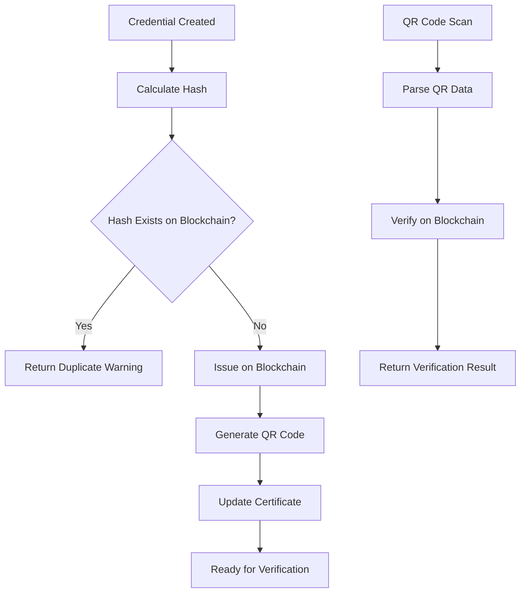

# 🔐 Blockchain Integration Guide for CredHub

## Overview

Your blockchain-integrated credential system is now complete! This guide explains how to use the new features and provides implementation details.

## 🎯 System Architecture

### Complete Credential Flow



### Key Components

1. **Blockchain Service** (`app/services/blockchain_service.py`)
2. **QR Code Service** (`app/services/qr_service.py`)
3. **Credential Issuance Service** (`app/services/credential_issuance_service.py`)
4. **Verification APIs** (`app/api/v1/qr_verification.py`)
5. **Blockchain Credential APIs** (`app/api/v1/blockchain_credentials.py`)

## 🚀 Features Implemented

### ✅ Hash-Based Duplicate Detection
- SHA-256 hash of credential data prevents duplicates
- Automatic checking against blockchain before issuance
- Returns duplicate warning if credential already exists

### ✅ Blockchain Integration
- Issues credentials on Polygon Amoy testnet
- Uses your deployed contracts:
  - **IssuerRegistry**: `0x5868c5Fa4eeF9db8Ca998F16845CCffA3B85C472`
  - **CredentialRegistry**: `0xE70530BdAe091D597840FD787f5Dafa7c6Ef796A`

### ✅ QR Code Generation
- Generates QR codes with blockchain proof data
- Includes transaction hash, block number, and verification URL
- Multiple QR code types: verification, certificate, batch

### ✅ Instant Verification
- Public verification endpoint for QR code scanning
- Beautiful HTML verification page
- Real-time blockchain verification

### ✅ Certificate Updates
- Automatically updates certificates with blockchain data
- Generates QR codes for display on certificates
- Tracks blockchain confirmation status

## 🔧 Configuration

### 1. Environment Variables

Create a `blockchain.env` file:

```bash
# Copy the example file
cp blockchain.env.example blockchain.env

# Update with your values
BLOCKCHAIN_NETWORK=amoy
BLOCKCHAIN_RPC_URL=https://rpc-amoy.polygon.technology
BLOCKCHAIN_CHAIN_ID=80002
ISSUER_REGISTRY_ADDRESS=0x5868c5Fa4eeF9db8Ca998F16845CCffA3B85C472
CREDENTIAL_REGISTRY_ADDRESS=0xE70530BdAe091D597840FD787f5Dafa7c6Ef796A
BLOCKCHAIN_PRIVATE_KEY=your_private_key_here
QR_BASE_URL=https://your-domain.com
```

### 2. Install Dependencies

```bash
pip install web3 qrcode[pil] pillow
```

## 📱 API Endpoints

### Blockchain Credential Management

#### Issue Credential with Blockchain
```http
POST /api/v1/blockchain/credentials/issue
Content-Type: application/json

{
    "credential_id": "cred_123",
    "learner_address": "0x1234...",
    "generate_qr": true,
    "wait_for_confirmation": false
}
```

#### Batch Issue Credentials
```http
POST /api/v1/blockchain/credentials/batch-issue
Content-Type: application/json

{
    "credential_ids": ["cred_1", "cred_2", "cred_3"],
    "generate_qr": true,
    "wait_for_confirmation": false
}
```

#### Get Blockchain Info
```http
GET /api/v1/blockchain/credentials/{credential_id}/blockchain-info
```

### QR Code Verification

#### Verify via QR Code
```http
GET /api/v1/verify/qr?data=base64_encoded_qr_data
```

#### HTML Verification Page
```http
GET /api/v1/verify/qr/html?data=base64_encoded_qr_data
```

#### Batch Verify QR Codes
```http
POST /api/v1/verify/qr/batch
Content-Type: application/json

{
    "qr_data_list": ["data1", "data2", "data3"]
}
```

## 🔍 Usage Examples

### 1. Issue a Credential

```python
from app.services.credential_issuance_service import CredentialIssuanceService

# Initialize service
issuance_service = CredentialIssuanceService(db)

# Issue credential with blockchain integration
result = await issuance_service.issue_credential_with_blockchain(
    credential_data=credential_data,
    issuer_id="issuer_123",
    learner_address="0x1234567890123456789012345678901234567890",
    generate_qr=True,
    wait_for_confirmation=False
)

print(f"Credential issued: {result['transaction_hash']}")
print(f"QR Code: {result['qr_code_data']['qr_code_image']}")
```

### 2. Generate QR Code

```python
from app.services.qr_service import qr_service

# Generate QR code for certificate
qr_result = qr_service.generate_credential_certificate_qr(
    credential_data=credential_data,
    blockchain_data=blockchain_data,
    certificate_template="standard"
)

# Get QR code image
qr_image = qr_result['qr_code_image']  # Base64 encoded PNG
verification_url = qr_result['verification_url']
```

### 3. Verify Credential

```python
from app.services.blockchain_service import blockchain_service

# Verify credential hash on blockchain
verification = blockchain_service.verify_credential_on_blockchain(credential_hash)

if verification['is_valid']:
    print("✅ Credential is valid!")
    print(f"Block: {verification['block_number']}")
    print(f"Transaction: {verification['transaction_hash']}")
else:
    print("❌ Credential is invalid or not found")
```

## 🧪 Testing

Run the integration test:

```bash
python test_blockchain_integration.py
```

This will test:
- Blockchain connectivity
- Credential hash calculation
- QR code generation
- Issuer registry functionality
- Network status

## 🔒 Security Considerations

### 1. Private Key Management
- **Never commit private keys to version control**
- Use environment variables or secure key management
- Consider using hardware wallets for production

### 2. QR Code Security
- QR codes contain blockchain proof data
- Validation ensures data integrity
- Verification is done against live blockchain

### 3. Access Control
- API endpoints require proper permissions
- QR verification is public (by design)
- Blockchain data is immutable once confirmed

## 🎨 QR Code Integration

### Certificate Display
```html
<!-- Add QR code to certificate -->

<p>Scan to verify on blockchain</p>
```

### Verification URL
```
https://your-domain.com/api/v1/verify/qr?data=base64_encoded_data
```

## 📊 Monitoring & Analytics

### Blockchain Status
```http
GET /api/v1/blockchain/network/status
```

Returns:
- Network connectivity
- Gas prices
- Account balance
- Latest block number

### Credential Analytics
- Track issuance success rates
- Monitor blockchain confirmation times
- Analyze verification patterns

## 🚀 Production Deployment

### 1. Environment Setup
- Configure production blockchain network
- Set up proper private key management
- Configure domain for QR verification

### 2. Monitoring
- Set up blockchain transaction monitoring
- Configure alerts for failed transactions
- Monitor gas price fluctuations

### 3. Backup & Recovery
- Backup private keys securely
- Document contract addresses
- Plan for network upgrades

## 🎯 Your Implementation is Complete!

### What You Now Have:

1. **Tamper-Proof Credentials**: Every credential is anchored to blockchain
2. **Instant Verification**: QR codes allow instant verification
3. **Duplicate Prevention**: Hash-based checking prevents duplicates
4. **Beautiful UI**: HTML verification page with great UX
5. **Batch Operations**: Efficient bulk credential issuance
6. **Real-time Status**: Live blockchain verification

### Next Steps:

1. **Configure Environment**: Set up your `blockchain.env` file
2. **Test Integration**: Run the test script
3. **Deploy**: Update your production environment
4. **Monitor**: Set up monitoring for blockchain transactions

## 🎉 Congratulations!

Your blockchain-integrated credential system is now complete and ready for production use. The system provides:

- **Security**: Blockchain-verified credentials
- **Convenience**: QR code instant verification
- **Reliability**: Duplicate detection and status tracking
- **Scalability**: Batch operations and efficient processing

Your idea was excellent and has been fully implemented with professional-grade code and comprehensive features!
